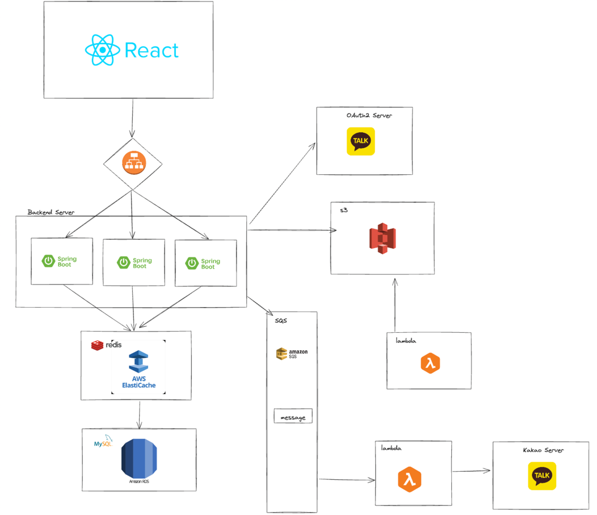
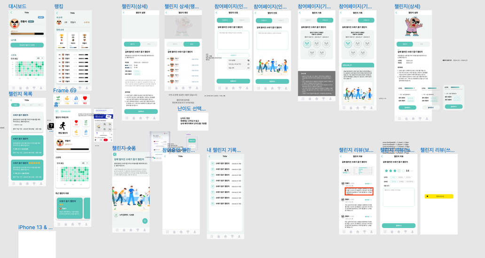
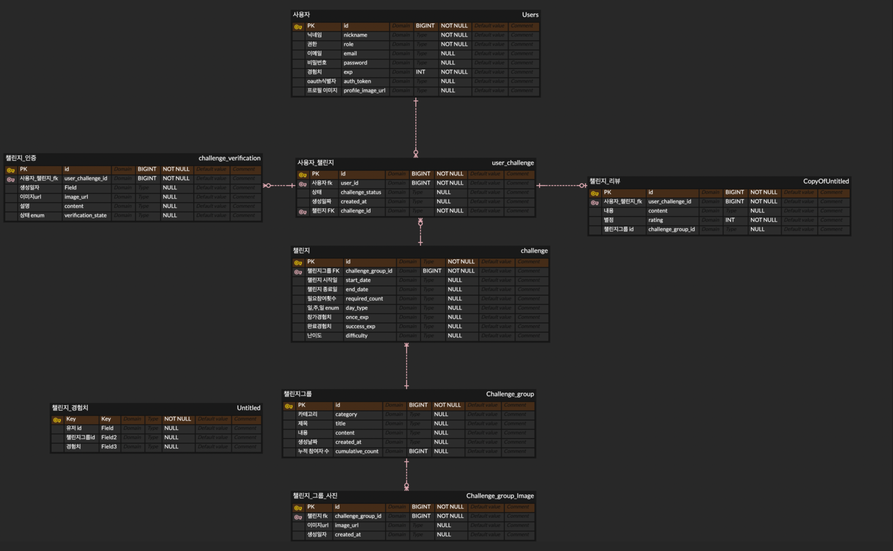
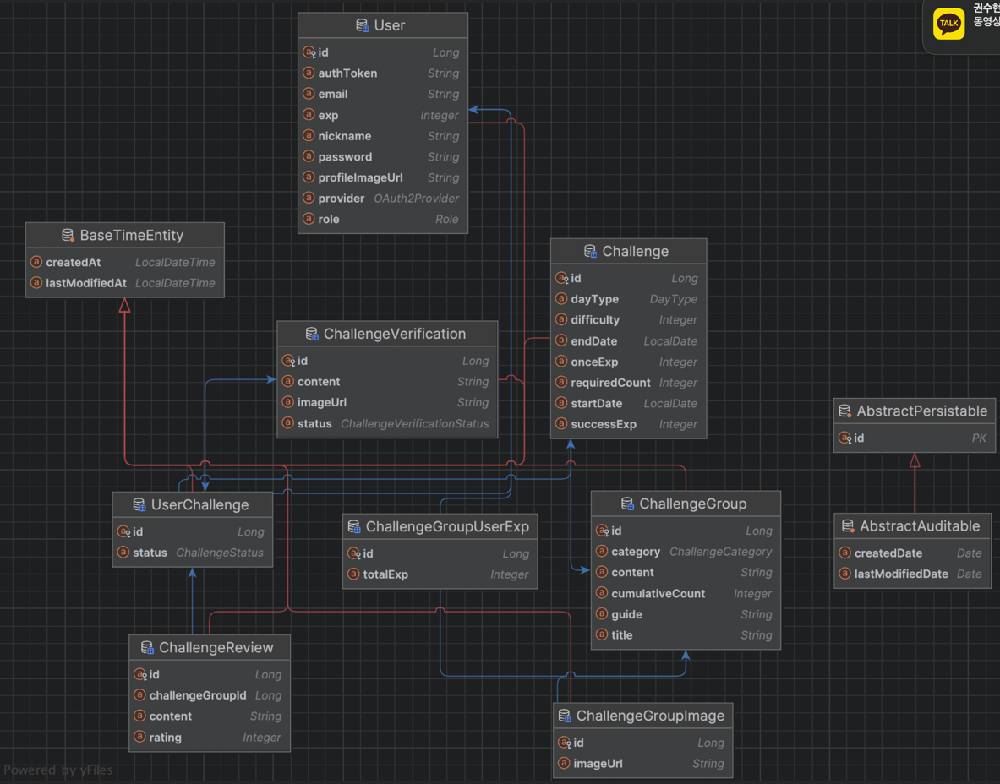

# 짠수니

## 데모

[KakaoTalk_Video_2024-06-02-04-50-08.mp4](..%2F..%2F..%2FDownloads%2FKakaoTalk_Video_2024-06-02-04-50-08.mp4)
[KakaoTalk_Video_2024-06-02-04-50-11.mp4](..%2F..%2F..%2FDownloads%2FKakaoTalk_Video_2024-06-02-04-50-11.mp4)
[KakaoTalk_Video_2024-06-02-04-50-15.mp4](..%2F..%2F..%2FDownloads%2FKakaoTalk_Video_2024-06-02-04-50-15.mp4)
[KakaoTalk_Video_2024-06-02-04-50-23.mp4](..%2F..%2F..%2FDownloads%2FKakaoTalk_Video_2024-06-02-04-50-23.mp4)

## 참여

1. [해달] 권다운
2. [해달] 권수현
3. [해달] 김강민
4. [해달] 손홍석

## 기획

### 동기

- 팀원 4명의 공통 관심사를 취합하였다. 그결과 `짠수니`라는 서비스를 기획하게 되었다.
- 사회에 긍정적인 영향 미치기 위해 노력하는 사람들을 위한 서비스를 만들고 싶었다.
- 사용자에게 재미를 주면서도, 사회에 긍정적인 영향을 미치는 서비스를 만들고 싶었다.

## 기능

### 1️⃣ 진행상황

사용자는 챌린지의 진행상황을 볼수있다.

- 주마다 4일참여해야하는 챌린지라면, 월,화,수의 기록을 볼수있어야한다.

### 2️⃣ 랭킹

1. 진행중인 각 챌린지 별, 유저가 얻은 경험치로 정렬해서 보여주기(상위 N명과, 사용자)
2. 참여중인 사용자수를 확인할 수 있다.
3. 전체 경험치 랭킹 보여주기(상위 N명과, 사용자)

### 3️⃣ 챌린지 게시

1. 관리자가 챌린지를 게시할 수 있다.
2. 챌린지에는 주제, 제목, 내용, 기간(정기적(ex매주3일)/일회성(ex달성하기)), 보상을 입력받는다.
    - 챌린지 운영기간을 명시해야한다.
3. 난이도란 챌린지의 세부적인 목표를 분류한것이다. 상중하로 분류된다. 난이도에 해당하는 목표를 작성할 수 있다.
    - (주 n일) / n개 달성

### 4️⃣ 챌린지 참여

1. 숏폼으로 챌린지를 랜덤으로 제공하여 사용자에게 보여준다. 사용자는 챌린지를 선택하여 참여할 수 있다.
2. 챌린지 참여 인증에는 사진과 설명으로 인증한다. (사진은 챌린지의 성격에 따라 다르다)

### 5️⃣ 챌린지 종료

1. 종료기간이 되거나 완료한 챌린지는 종료된다.
2. 챌린지를 완수한 사용자는 추가 보상을 받는다.

### 주제

> 주제는 에코, 봉사, 선행, 나눔, 건강 총 5가지로 분류하여 나타낸다.

### 1️⃣ 에코

환경에 관련된 챌린지를 나타낸다.

- 예를 들어 전기 절약 → 얼마나 절약되었는지/ 몇리터를 아꼈습니다.
- 매연의 감소와 같은 절약

### 2️⃣ 선행

선행에 관련된 챌린지를 나타낸다.

- 예를 들어 쓰레기 줍기, 앞사람에게 인사하기 등등

### 3️⃣ 나눔

나눔에 관련된 챌린지를 나타낸다.

- 예를 들어 나무젓가락 나눔

### 4️⃣ 건강

건강에 관련된 챌린지를 나타낸다.

- 예를 들어 걷기

### 5️⃣ 레벨 시스템

### 01. 스트릭

- 유저의 날짜별 활동을 기록한다. 이 기록에는 챌린지 참가기록, 연속참가일자로 구성된다.
  멋있는 UI로 표현된다.
- 달마다의 스트릭정보를 볼수있다.(페이징)

### 02. 티어

- 티어는 노비-상민-평민-양반-진골-성골-에코로 구성된다
- 티어별 경험치표가 존재한다.
    - 티어별 4단계로 구성된다.
- 티어 순서는 4,3,2,1 순으로 올라간다.

### 6️⃣ 게시글

### 챌린지

리뷰 및 피드백

1. 챌린지의 만족도와 후기를 작성할 수 있다.
2. 만족도는 1,2,3,4,5점으로 줄 수 있다.
3. 만족도는 챌린지의 기록정보에 저장된다. (만족도가 낮은 챌린지는 관리자가 확인하고 제외할 수 있다)
4. 최근 챌린지만족도를 메인화면에서 조회할 수 있다, 챌린지상세페이지에서 리뷰를 조회할 수 있다.

## 나중에 넣을 기능 (V2)

### 1. 문의 게시글

### 2. 챌린지 빙고 넣기

### 3. 엘라스틱 서치로 사용자 기록을 보고 추천서비스

### 4. 기록을 바탕으로 일기를 만들어주고 짠돌이가 칭찬해줘요

### 5. 퀴즈

### 6. 챌린지 신설 요청

- 유저들의 챌린지 요청 게시글을 볼 수 있다.
- 추천기능이 존재하여, 사용자들의 수요를 볼 수 있다.

## 향후 아키텍쳐

## 전체적인 View

## 기술 스택

- Frontend: React, styled-components
- Backend: Spring, JPA, MySQL, S3

## ERD

## CLASS DIAGRAM

